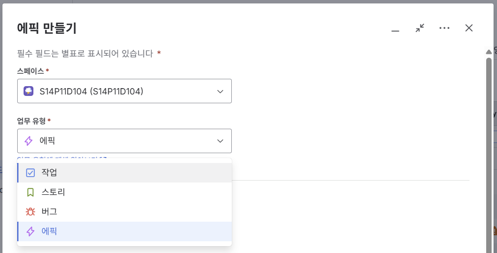
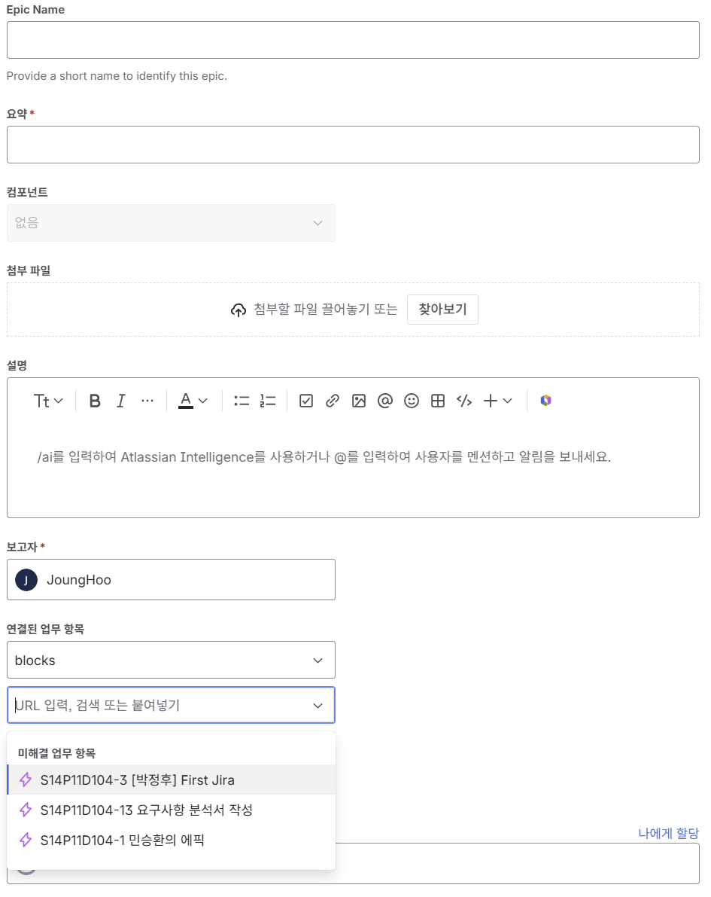
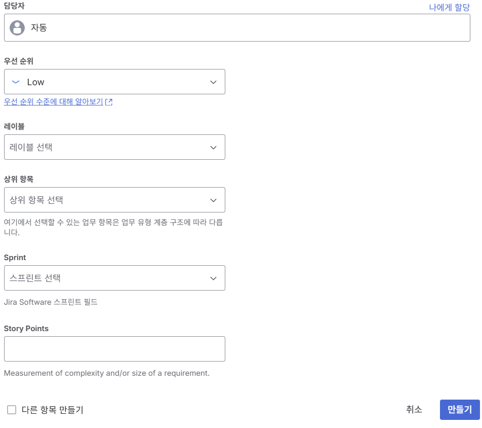
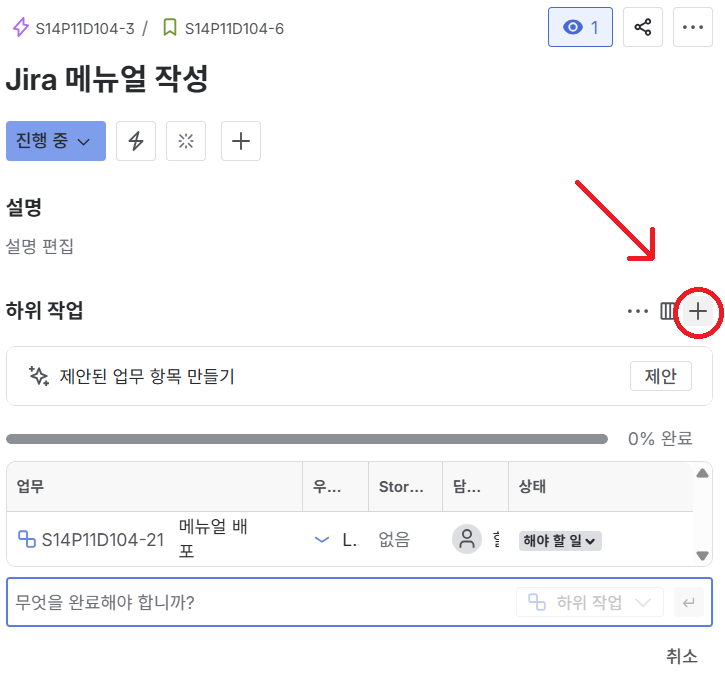
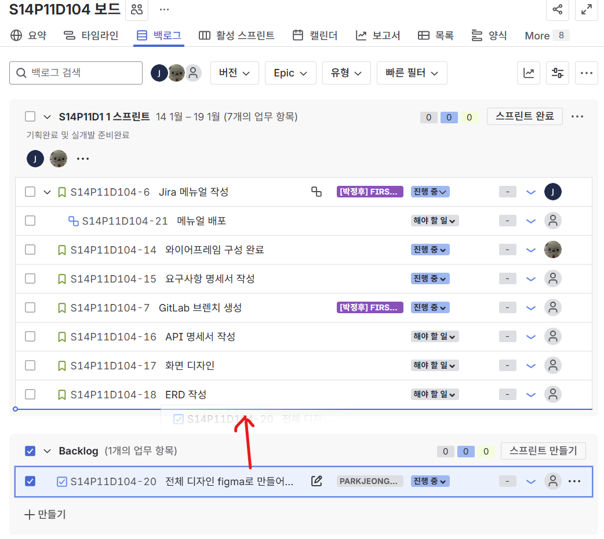

# 📌 Jira 이슈 생성 & 관리 가이드

업무를 Jira에서 체계적으로 관리하기 위해
Epic → Story/Task → Sub-task 구조로 이슈를 생성한다.

## 🚩 이슈 생성

- 1단계: 에픽 생성
- 2단계: 세부 이슈(Task/Story/Bug) 생성
- 3단계: 하위작업 (Job/Sub-Task) 생성

Jira 상단의 **[만들기]** 버튼을 누르고 업무 유형을 선택합니다.

> 💡**이슈목록** 
> - 작업 (Task): 일반적인 할 일
> - 스토리 (Story): 사용자 관점의 기능 요구사항
> - 버그 (Bug): 시스템 오류, 결함 또는 기대와 다른 동작에 대한 서비스 수정사항 발생 시
> - 에픽 (Epic): 여러 개의 작업/스토리를 묶어주는 단위

## 📝 각 필드의 작성 방법

1. Epic Name (에픽 전용): 에픽 리스트에서 식별하기 위한 짧은 이름

2. 요약 (Summary): 업무의 제목입니다. (예: [FE] 로그인 페이지 레이아웃 구현, [BE]사용자 기능 구현, [BE] 지도 기능 구현)
    >💡 **태그 규칙 (Tagging Rules)**
    >> **에픽의 경우 태그 작성이 모호하면 태그 작성하지 않음**
    > - **[FE]** : 프론트엔드 (예: [FE] 로그인 페이지 레이아웃 구현)
    > - **[BE]** : 백엔드 (예: [BE] 사용자 인증 API 구현)
    > - **[AI]** : AI (예: [AI] 이미지 분류 모델 학습)
    > - **[Infra]** : 아키텍처/인프라 (예: [Infra] Jenkins 파이프라인 구축)
    > - **[DB]** : 데이터베이스 (예: [DB] 알림 내역 테이블 생성)
    > - **[Design]** : 디자인 (예: [Design] 피그마 메인 페이지 프로토타입)
    > - **[Docs]** : 문서 작성 (예: [Docs] API 명세서 업데이트)
    > - **[Common]** : 공통 작업 (예: [Common] 공통 Axios 인터셉터 설정)
    > - **[Bug]** : 버그 수정 (예: [Bug] 로그인 버튼 클릭 오류 수정)

3. 설명 (Description): 업무의 상세 내용이나 작업 체크리스트를 작성

4. 보고자: 본인으로 자동 설정 - 필요시 변경

5. 연결된 업무 항목: 이 작업과 연관된 다른 작업이 있다면 등록

6. 담당자(Assignee): 실제로 이 업무를 수행할 팀원을 지정 (나에게 할당 가능)

7. 우선순위(Priority): 업무 우선 순위 설정 (High, Medium, Low 등)

8. 상위 항목(Parent): 이 작업이 어떤 **'에픽'**에 포함되는지 선택, 이를 통해 업무의 계층 구조가 완성

9.  스프린트(Sprint): 현재 진행 중인 우리 팀의 스프린트 차수를 선택

10. 스토리 포인트(Story Points): 해당 업무의 난이도나 예상 소요 시간을 숫자로 입력합니다. (1~10)
    - 10 : [매우 위험/복잡] 어떻게 시작해야 할지 전혀 모르겠고, 범위가 너무 커서 실패할 확률이 높은 작업 (반드시 쪼개야 함)
    - 9 : [대규모] 공부해야 할 양이 너무 많고, 다른 팀원들의 코드와 얽혀 있어 조심스러운 큰 작업
    - 8 : [고난도] 로직이 매우 복잡하여 하루 종일 집중해도 끝낼 수 있을지 확신이 서지 않는 작업
    - 7 : [상당한 부담] 구현해야 할 화면이나 기능이 많고, 중간에 예상치 못한 문제가 터질 것 같은 작업
    - 6 : [연구 필요] 방법은 대략 알지만, 처음 해보는 기술이라 구글링과 삽질이 필연적으로 예상되는 작업
    - 5 : [표준 작업] 우리 프로젝트의 평균적인 기능 하나를 만드는 수준 (어느 정도 집중과 시간이 필요함)
    - 4 : [약간의 고민] 단순하진 않지만, 기존 코드를 참고하면 충분히 스스로 해결 가능한 작업
    - 3 : [명확함] 무엇을 해야 할지 머릿속에 바로 그려지고, 큰 변수 없이 처리할 수 있는 작업
    - 2 : [단순] 시간이 조금 걸릴 뿐, 단순 반복이거나 아주 익숙한 코드 수정 작업
    - 1 : [매우 단순] 오타 수정, 문서 한 줄 수정 등 고민 없이 바로 끝낼 수 있는 작업

    > 💡 스토리 포인트 산정 가이드
    시간이 아니라 '무게': 같은 3포인트라도 숙련자에겐 30분, 초보자에겐 3시간이 걸릴 수 있습니다. 각자가 느끼는 업무의 무게감을 공유하는 것입니다.

    > 불확실성을 반영하세요: 기술적으로 생소한 분야라면 단순히 양이 적어도 포인트를 높게!

    > 상위 항목과 연결 필수: 난이도를 정했다면 이 업무가 어떤 에픽에 기여하는지 꼭 확인하여 상위 항목(Parent) 필드 지정

---

## 📝 하위 작업 생성

> 💡 계층 구조 상기 : 에픽(Epic) ➔ 스토리(Story) ➔ 하위 작업(Sub-task/Job)

1. 스토리 선택: 에픽 상세 페이지 또는 로드맵 화면에서 구체화할 스토리를 클릭하여 상세 화면으로 진입

2. [하위 작업 추가] 클릭: 스토리 제목 하단이나 우측 메뉴에 있는 [+] 버튼

3. 실무 중심의 작업 등록: 실제로 수행할 액션 작성. 이때도 요약 규칙([Tag] : 내용)을 적용하여 관리
   - [FE] : 로그인 입력창 유효성 검사 컴포넌트 개발
   - [BE] : 카카오 로그아웃 API 연동 처리
---

## 📅 스프린트 운영 및 업무 관리
이슈 생성이 완료되었다면, 정해진 기간(Sprint) 내에 목표한 업무를 완수하기 위해 보드를 관리 한다.

### 1. 스프린트 계획 및 시작

1. 백로그 이동: 생성된 이슈들을 이번 주차에 진행할 '활성 스프린트' 영역으로 이동 (Click & Drag)

2. 스프린트 지정: 각 이슈의 상세 설정에서 현재 팀이 진행 중인 Sprint 항목을 반드시 선택해야 보드에 표시됨

3. 포인트 확인: 팀원 전체의 스토리 포인트 합계를 확인하여 일주일간 수행 가능한 적정 업무량인지 검토

### 2. 보드를 활용한 상태 관리 (Workflow)
1. 스프린트가 시작되면 보드에서 이슈 카드를 드래그 앤 드롭하여 팀원들에게 실시간 진행 상황을 공유합니다.

2. 해야 할 일 (To Do): 아직 시작하지 않은 업무로, 이슈 생성 시 기본값으로 설정됩니다.

3. 진행 중 (In Progress): 현재 담당자가 작업을 수행 중인 상태입니다.

4. 주의: 한 명이 동시에 여러 개의 '진행 중' 이슈를 가지지 않도록 관리합니다.

5. 완료 (Done): 코드 리뷰가 완료되고, 해당 기능이 테스트를 통과하여 병합(Merge)된 상태를 의미합니다.

### 3. 데일리 스크럼
1. 매일 아침 진행하는 스크럼 미팅 시 Jira 보드를 기준으로 진행

2. 병목 현상 확인: '진행 중'에 너무 오래 머물러 있는 이슈가 있는지 확인

3. 이슈 업데이트: 전날 완료된 업무가 '완료' 상태로 옮겨졌는지 확인하고, 담당자가 없는 이슈가 있는지 체크

### 4. 이슈 마감 및 스프린트 종료
1. 스프린트 기간이 종료되면 전체 업무를 리뷰하고 다음 스프린트를 준비

- **완료된 이슈**: '완료' 상태의 이슈들을 보며 이번 스프린트의 성과를 확인

- **미완료 이슈**: 기간 내 종료하지 못한 업무는 다음 스프린트로 이월하거나 백로그로 다시 이동한다. 이때, 왜 완료하지 못했는지(포인트 산정 오류, 기술적 난관 등)를 댓글로 남겨 기록 및 리뷰 필수

- **스프린트 보고서**: Jira에서 제공하는 번다운 차트를 확인하여 팀의 작업 속도 파악

>💡마지막 팁
> - 댓글 활용: 작업 중 알게 된 특이사항이나 변경된 요구사항은 이슈 하단 댓글에 기록하여 히스토리를 관리한다.
> - 담당자 변경: 만약 협업 과정에서 작업 주체가 바뀐다면 즉시 **담당자(Assignee)**를 변경하여 책임 소재를 명확히 한다.