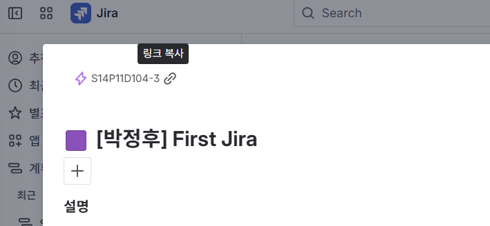

# 📌 깃 커밋 컨벤션 - D104_1.1
> "태그: 한글 요약" 형태로 작성하며, 불필요한 영어 표현을 지양하고 팀원 간의 가독성을 최우선으로 한다.

### 💡 예시
```
<태그>: <요약>
[옵션 본문] - 본문
[옵션 푸터] - Jira 이슈 링크
---
제목 : `feat: 사용자 로그인 API 유효성 검사 추가`
본문 : - `아이디 미입력 시 400 에러 반환 로직 추가`
푸터 : https://ssafy.atlassian.net/browse/S14P11D104-6

```


> Jira 링크를 복사하여 푸터에 기입

### 📝 커밋 태그

모든 커밋 메시지는 아래의 태그를 서두에 사용하며, 내용은 한국어로 작성한다.

| 태그 (Tag) | 설명 (Description) |
| --- | --- |
| **feat** | 새로운 기능 추가 |
| **fix** | 버그 수정 |
| **docs** | 문서 수정 (README, Swagger, 위키 등) |
| **style** | 코드 의미에 영향을 주지 않는 변경 (포맷팅, 세미콜론 누락 등) |
| **refactor** | 코드 리팩토링 (기능 변화 없음) |
| **test** | 테스트 코드 추가 및 수정 |
| **chore** | 빌드 업무, 패키지 설정, 환경 설정 변경 (gradle, yml 등) |
| **perf** | 성능 개선 |
| **rename** | 파일 혹은 폴더명 수정/이동 |

---

### 🌿 브랜치 작명 규칙 (Branch Naming Convention)

> 구조 : **`[fe/be]/태그/기능-요약`**
> 
> **소문자 영문**과 **하이픈(-)** 사용 (Kebob-Case)
> 
> 예시: `be/feat/login-api`, `be/fix/db-connection`, `fe/feat/login-ui`


### ⚠️ 작성 규칙 (Rules)

1. **소문자 사용:** 모든 브랜치명은 소문자로 작성
2. **축약어:** JWT, DB, API등 영어 축약어의 경우 예외적으로 대문자로 사용
3. **구분자:** 단어 사이는 하이픈(`-`)을 사용
4. **명확한 요약:** `feat/user` 보다는 `feat/user-login-validation`과 같이 구체적으로 작성
5. **일회성 브랜치:** 기능 개발이나 버그 수정이 완료되어 `develop`에 `merge`된 브랜치는 가급적 삭제


| 태그 | 설명 |
| --- | --- |
| **main** | prod / stable 브랜치 |
| **develop** | 다음 출시 버전을 대비해 개발을 진행하는 통합 브랜치 |
| **backend** | 백엔드 개발 브랜치 |
| **frontend** | 프론트엔드 개발 브랜치 |
|**hotfix**| main 브랜치 버그 수정 시 사용 |
| **feat** | 새로운 기능 개발 시 사용 |
| **fix** | 버그 수정 시 사용 |
| **refactor** | 코드 리팩토링 시 사용 |
| **docs** | 문서 작성 및 수정 시 사용 |
| **chore** | 설정 변경, 라이브러리 추가 등 단순 작업 시 사용 |


---

### 💡 적용 예시

* **기능 추가 시:** `feat/social-login`
* **버그 수정 시:** `fix/token-expired-error`
* **환경 설정 변경 시:** `chore/gradle-dependency-update`
* **문서 작업 시:** `docs/api-specification`